# Rapport de Workshop : Programmation & Algorithmique (C++)

**Nom / Prénom :** WONG Yanis
**Groupe :** IMAC-1 TD2
**Date :** 02/02/26 - 06/02/26

---

## Exercice 1 : ⭐ Ne garder que le vert

### Rendu Visuel
| Image Originale | Résultat |
| :---: | :---: |
|  |  |

### Analyse
* **Spécificités de l'algo :** * Changer les couleurs du pixel rouge et bleu à 0.

---

## Exercice 2 : ⭐ Échanger les canaux

### Rendu Visuel
| Image Originale | Résultat |
| :---: | :---: |
|  |  |

### Analyse
* **Spécificités de l'algo :** * Il faut échanger les valeurs du rouge et bleu d'un pixel entre eux. Afin d'éviter d'utiliser une variable de stockage intermédiaire j'ai utiliser "swap".

---

## Exercice 3 : ⭐ Noir & Blanc

### Rendu Visuel
| Image Originale | Résultat |
| :---: | :---: |
|  |  |

### Analyse
* **Spécificités de l'algo :** * Application de formule trouvé sur internet.

---

## Exercice 4 : ⭐ Négatif

### Rendu Visuel
| Image Originale | Résultat |
| :---: | :---: |
|  |  |

### Analyse
* **Spécificités de l'algo :** * Pour passer en négatif, soustraire à 1  chaque valeur r, g, b des pixels.

---

## Exercice 5 : ⭐ Dégradé

### Rendu Visuel
| Image Originale | Résultat |
| :---: | :---: |
| Vide |  |

### Analyse
* **Spécificités de l'algo :** * On connait les valeurs de début et de fin, on connait la taille de l'image, il suffit alors par des conditions et une boucle (qui se répète tant qu'on a pas parcourus toute l'image), de créer une variable fade de type float qui s'incrémente de 1/taille de l'image. Avec cette variable comme le dégradé et en noir et blanc, on redéfinit la valeur rgb de chaque pixel par fade.
  
* **⚠️ Pièges à éviter :**
    * Ne pas oublier de prendre en compte la taille de l'image pour l'incrémentation du dégradé.

---

## Exercice 6 : ⭐⭐ Miroir

### Rendu Visuel
| Image Originale | Résultat |
| :---: | :---: |
|  |  |

### Analyse
* **Spécificités de l'algo :** * On créer une copie de l'image en parametre pour changer les pixels un à un entre le début et la fin en même temps, on s'arrete à la moitié de la taille de l'image (col/x).
* **⚠️ Pièges à éviter :**
    * Ne pas oublier de s'arrêter à la moitié de la width de l'image (col/x)

---

## Exercice 7 : ⭐⭐ Image bruitée

### Rendu Visuel
| Image Originale | Résultat |
| :---: | :---: |
|  | 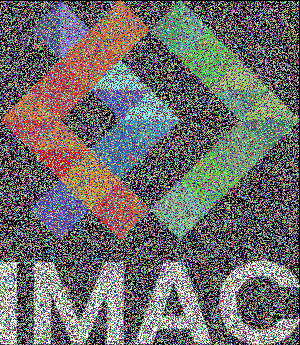 |

### Analyse
* **Spécificités de l'algo :** * Il faut changer de maniere aléatoire le r,g,b des pixels, ici je le fais en parcourant le tableau. Mais j'aurais pu contrôler l'effet de bruit en déterminant soit un nombre précis de changement aléatoire, soit un nombre aléatoire de changement compris entre un intervalle de valeur. 

---

## Exercice 8 : ⭐⭐ Rotation de 90°

### Rendu Visuel
| Image Originale | Résultat |
| :---: | :---: |
|  |  |

### Analyse
* **Spécificités de l'algo :** * Créer une nouvelle image qui a pour largeur la hauteur de l'ancienne image et pour hauteur la largeur de l'ancienne image. Le plus complexe était de transposer une colonne en ligne et dans le bon sens.
* **⚠️ Pièges à éviter :**
    * Ne pas oublier le "-1" pour les largeur et hauteur de l'image lorsqu'on utilise une boucle for.

---

## Exercice 9 : ⭐⭐ RGB split

### Rendu Visuel
| Image Originale | Résultat |
| :---: | :---: |
|  |  |

### Analyse
* **Spécificités de l'algo :** * Consiste à placer le rouge, le vers et le bleu d'une image de base séparément dans une nouvelle image. Celle ci ce fait en fonction d'un décalage que l'on détermine préalablement en fonction du résultat qu'on souhaite obtenir. 
* **⚠️ Pièges à éviter :**
    * On doit prendre en compte la taille de l'image pour pas que ca sorte du cadre.

---

## Exercice 10 : ⭐⭐ Luminosité

### Rendu Visuel
| Image Originale | Résultat 1 | Résultat 2 |
| :---: | :---: | :---: |
|  |  |  |

### Analyse
* **Spécificités de l'algo :** * On créer ici deux images (une qui sera plus claire, l'autre qui sera plus foncé que l'image original) qui sont des copies de l'image passée en paramètre, ensuite, on parcours chaque pixel de la première copie et pour chacune de ses composantes r,g,b, on va la mettre à la puissance qui la rapprochera un peu plus de le valeur blanche (0), la valeur de la puissance est choisis arbitrairement. Pour l'image plus foncé, c'est le même principe, sauf que la puissance ici sera, une puissance qui rapprochera les valeurs du noir(1).
  
* **⚠️ Pièges à éviter :**
    * Il faut faire attention aux valeurs des puissances, elle risque sinon de rendre un résultat trop blanc ou trop noir.

---

## Exercice 11 : ⭐⭐(⭐) Disque

### Rendu Visuel
| Image Originale | Résultat |
| :---: | :---: |
| Vide |  |

### Analyse
* **Spécificités de l'algo :** * Il suffisait ici de s'appuyer sur la relation mathématique d'un disque, en vérifiant si l'égalité est vérifiée (x² + y² <= r²), on sait si on doit colorier le pixel en blanc ou en noir (vérifié = blanc, pas vérifié = noir).

---

## Exercice 12 : ⭐ Cercle

### Rendu Visuel
| Image Originale | Résultat |
| :---: | :---: |
| Vide |  |

### Analyse
* **Spécificités de l'algo :** * C'est le même principe que l'exercice précédent sauf qu'ici on fixe un intervalle de valeur dans la condition qui colorie en blanc. On dit ici en plus de la condition précédente que si "x²+y²" est supérieur ou égale au même rayon - une valeur "p" au carré alors cette fois on colorie en blanc.

---

## Exercice 13 : ⭐⭐ Animation

### Rendu Visuel
| Image Originale | Résultat |
| :---: | :---: |
|  | 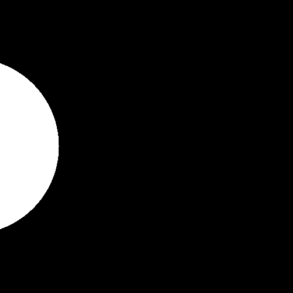 |

### Analyse
* **Spécificités de l'algo :** * Il suffit de déplacer sur l'axe x le cercle à chaque itération ainsi qu'après avoir save l'image, remplacer la grille entière de pixel par du noir et de le faire partir d'un point x en dehors du cadre le disque.

---

## Exercice 14 : ⭐⭐⭐ Rosace

### Rendu Visuel
| Image Originale | Raté 1 | Résultat |
| :---: | :---: | :---: |
| Vide | 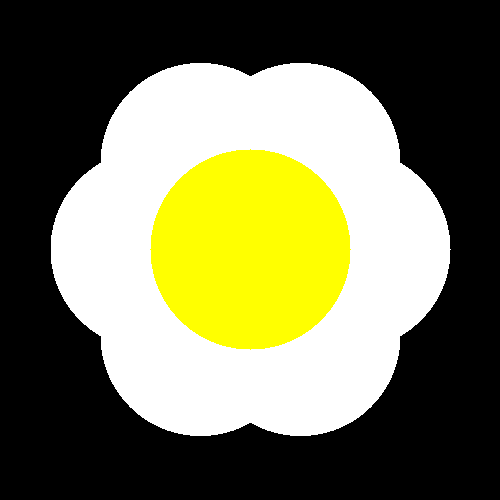 |  |

### Analyse
* **Spécificités de l'algo :** * On place le premier cercle au centre à partir du code précédent et ensuite à partir de relation mathématique pour passer de coordonnées cartésiennes à polaire, on place les autres cercles tant qu'il n'y pas eu 7 cercles tracés.
* La version raté ne ressemblait pas autant à une fleur, j'avais obtenu ce résultat en dupliquant mal une partie de mon code à l'écrit, et comme je trouvais que ca ressemblait à une fleur, j'ai fini la fleur.

---

## Exercice 15 : ⭐⭐ Mosaïque

### Rendu Visuel
| Image Originale | Résultat |
| :---: | :---: |
|  |  |

### Analyse
* **Spécificités de l'algo :** * Il suffit de créer une nouvelle image qui fait x fois la hauteur de l'image de base et x fois sa largeur de base (en fonction du nombre de répétition). Ensuite, il n'y a plus qu'a dupliquer l'image.
---

## Exercice 16 : ⭐⭐⭐⭐ Mosaïque miroir

### Rendu Visuel
| Image Originale | Raté 1 | Raté 2 | Raté 3 | Résultat |
| :---: | :---: | :---: | :---: | :---: |
|  | 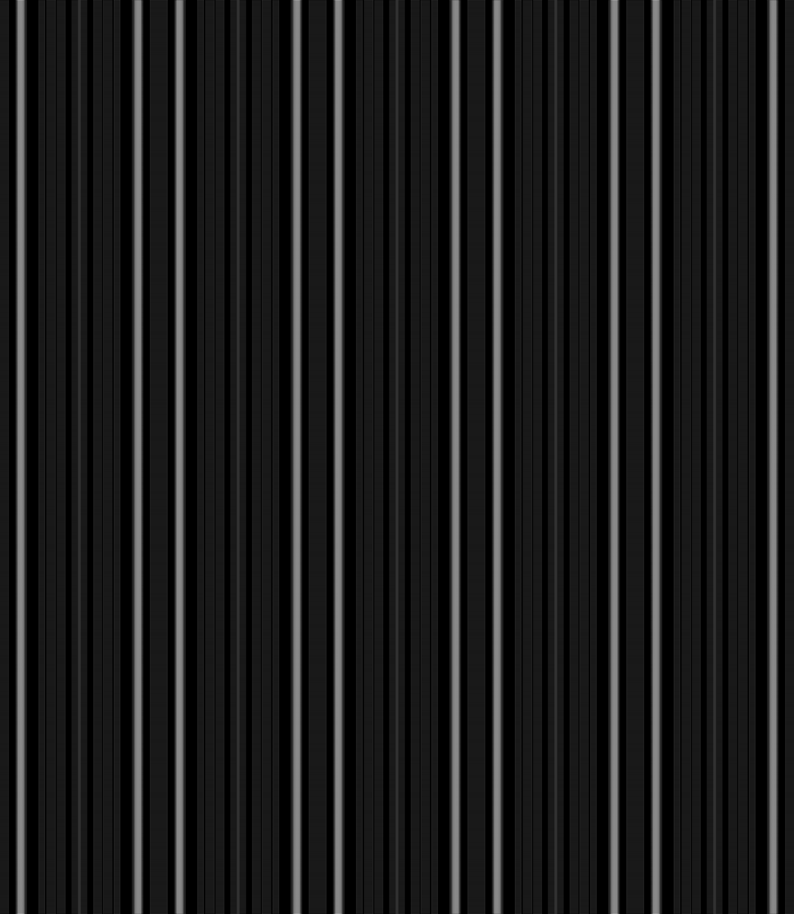 | 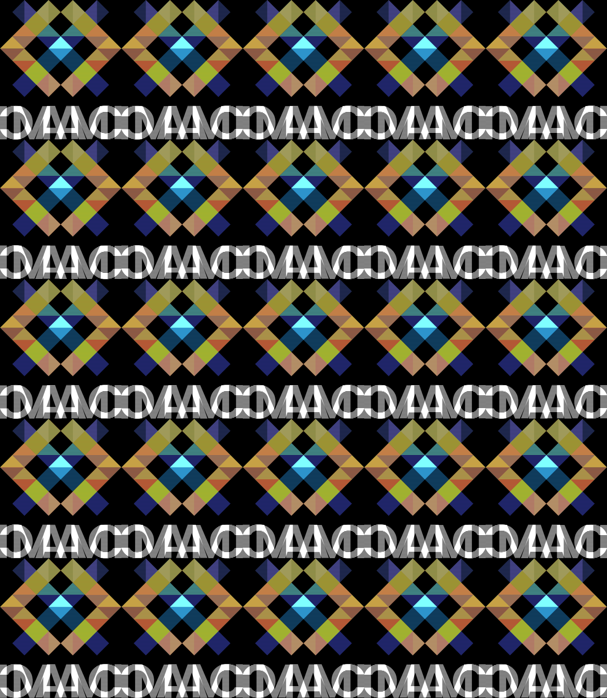 |  |  |

### Analyse
* **Spécificités de l'algo :** * Pour cet algo, il faut en premier temps faire le miroir comme dans l'exercice précdent, puis de faire le miroir de ce miroir et ainsi de suite.
* **⚠️ Pièges à éviter :**
    * Faire attention à partir de quand on fait le miroir.
---

## Exercice 17 : ⭐⭐⭐ Glitch

### Rendu Visuel
| Image Originale | Résultat |
| :---: | :---: |
|  | 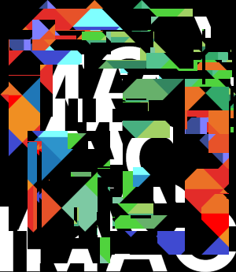 |

### Analyse
* **Spécificités de l'algo :** * Consiste à prendre des blocs de largeur et hauteur définis aléatoirement à des emplacement aléatoires et de les interchanger à des endroits aléatoires en prenant en compte la taille de l'image pour pas que ça dépasse le cadre de l'image.

---

## Exercice 18 : ⭐⭐⭐ Tri de pixels

### Rendu Visuel
| Image Originale | Résultat |
| :---: | :---: |
|  | 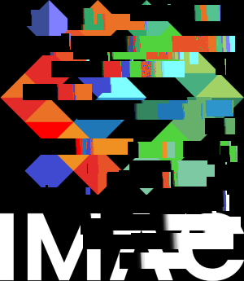 |

### Analyse
* **Spécificités de l'algo :** * On applique ici le même principe que l'exercice précédent sauf qu'on n'interchange pas de place et qu'on trie en fonction de la fonction de la luminosité chaque pixel.

* **⚠️ Pièges à éviter :**
    * Lorsqu'on divise ou multiplie des float par un autre nombre, celui doit aussi être un float.

---

## Exercice 19 : ⭐⭐⭐(⭐) Fractale de Mandelbrot

### Rendu Visuel
| Image Originale | Résultat |
| :---: | :---: |
| Vide | 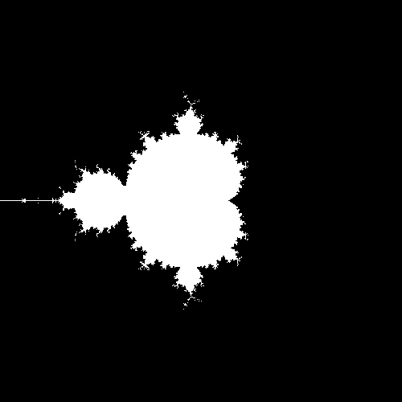 |

### Analyse
* **Spécificités de l'algo :** * On reprend le code donner et on l'adapte en c++ dans notre environnement.
---

## Exercice 20 : ⭐⭐⭐(⭐) Dégradés dans l'espace de couleur Lab

### Rendu Visuel
| Image Originale | Raté 1 | Raté 2 | Résultat v1 | Résultat v2 |
| :---: | :---: | :---: | :---: | :---: |
| Vide | 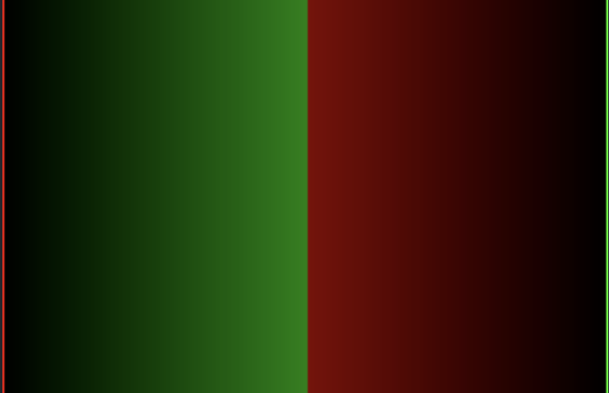 | 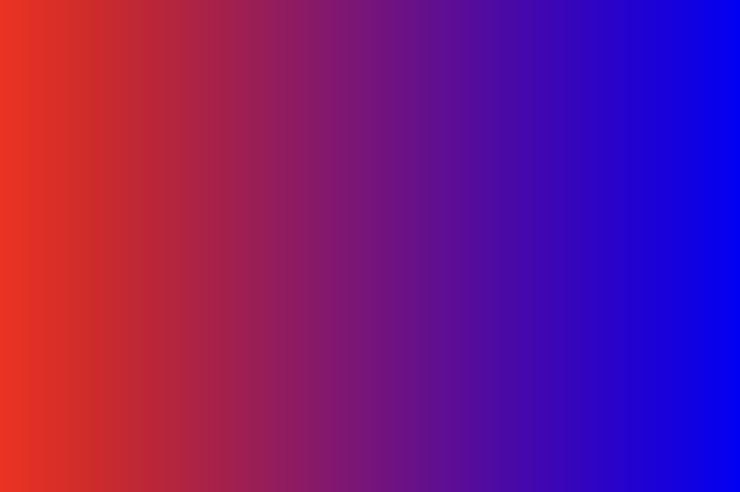 | 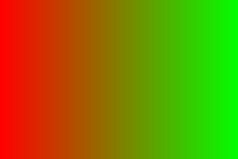 | 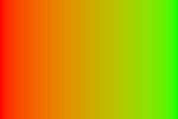 |

### Analyse
* **Spécificités de l'algo :** * Pour ma part, j'ai essayé de reprendre le dégradé avec mon code de dégradé du noir vers le blanc, mais ce n'était pas possible alors j'ai utiliser la propriété glm::mix pour le dégradé classique.

Pour le dégradé améliorer il fallait prendre la valeur en OKLAB au lieu de sRGB/RGB et pour faire ca il fallait passer par des conversions. De RGB à linéaire, de linéaire à OKLAB, appliquer le glm::mix, puis de OKLAB à linéaire et de linéaire à RGB et appliquer la couleur aux pixels.

---

## Exercice 21 : ⭐⭐⭐(⭐) Tramage

### Rendu Visuel
| Image Originale | Résultat |
| :---: | :---: |
|  |  |

### Analyse
* **Spécificités de l'algo :** * Traduction du code donnée et suppression du code et des fonctions inutiles.
* **⚠️ Pièges à éviter :**
    * Rester bloqué sur les fonctions non connus en c++.
---

## Exercice 22 : ⭐⭐⭐(⭐) Normalisation de l'histogramme

### Rendu Visuel
| Image Originale | Résultat |
| :---: | :---: |
|  |  |

### Analyse
* **Spécificités de l'algo :** * Prendre le pixel le plus claire et le plus sombre, trouver l'équation pour passer la valeur la plus claire à 0 et la plus sombre à 1 avec la même équation puis l'appliquer à tout les pixels.

---

## Exercice 23 : ⭐⭐⭐⭐ Vortex

### Rendu Visuel
| Image Originale | Résultat |
| :---: | :---: |
|  | 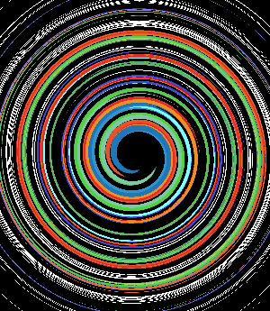 |

### Analyse
* **Spécificités de l'algo :** * On prend un point de départ et le centre de l'image et on le fait tourner d'un certain angle en fonction de la distance avec le point au centre.
---
